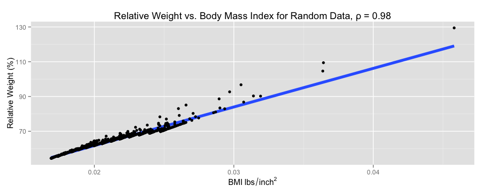

# Vignette: Spurious Correlation
  
  

<script type="text/javascript" src="js/jquery.min.js"></script>
<script type="text/javascript" src="js/jquery-ui.min.js"></script>
<script type="text/javascript" src="js/jquery.fancybox-1.3.4.pack.min.js"></script>
<script type="text/javascript" src="js/jquery.tocify.js"></script>
<script type="text/javascript" src="js/jquery.scianimator.min.js"></script>
<script type="text/javascript" src="js/page.js"></script>
<script>  </script>
<link type="text/css" rel="stylesheet" href="css/jquery.tocify.css" />
<link type="text/css" rel="stylesheet" media="screen" href="css/jquery.fancybox-1.3.4.css" />
<link type="text/css" rel="stylesheet" href="css/style.css"
<head> <div id="tableofcontents"></div> </head>
<div id="source" class="tocify"> 
<ul class="tocify-header nav nav-list">
<li class="tocify-item active" style="cursor: pointer;">
<a onclick='toggle_R();' >Show / Hide Source</a>
</li></ul>
</div>

__Kevin M. Smith // Environmental Statistics // Fall 2014__
<hr>

```r
library(knitr)
library(ggplot2)
library(xtable)
library(gridExtra)
library(pander)

opts_knit$set(fig.width = 10,
              xtable.type = 'html',
              warning = FALSE,
              cache = TRUE,
              dev = 'png')


options(xtable.comment = FALSE)
panderOptions('table.split.table', Inf)
```

# Overview
The purpose of this short note is to explore spurious correlation. There are two common uses of the phrase _spurious correlation_, which are referred to here as Type I and Type II. 

# Type I

Most often the phrase refers to the appearance of __a strong relationship between two variables to which no shared causal driver can be reasonably proposed__. These apparent relationships arise as a natural consequence of looking for relationships across many variables, especially when sub-setting. 

## Example - Sunspots
A popular example is the correlation between sunspot activity and the number of Republicans in the U.S. Senate observed between 1960 and 1980. Proposing a shared causal driver here is a tenuous undertaking. It is more reasonable to propose that the two highly oscillatory series came into sync for about two decades by chance, before diverging again. The graphs below show how the choice of data subset has dramatic consequences on the cross-correlation of the series. 


```r
sunspots <- read.csv('data/sunspots.csv')
republicans <- read.csv('data/senateRepublicans.csv')
sr.df1 <- data.frame(`annual sunspot count` = sunspots[,2], `number of republicans in senate` = republicans[,2])
sr.df2 <- data.frame(`annual sunspot count` = sunspots[61:81,2], `number of republicans in senate` = republicans[61:81,2])

gt <- ggplot(sunspots, aes(y = scale(sunspots[,2]), x = sunspots[,1], color = "sunspots"))
gt <- gt + geom_line(lwd = 2)
gt <- gt + geom_line(aes(y = scale(republicans[,2]), color = "republicans"), lwd=2)
gt <- gt + scale_colour_manual(name='', values=c('sunspots'='grey40', 'republicans'='black'))
gt <- gt + geom_vline(xintercept = c(1961, 1981), lty = 2, lwd=1)
gt <- gt + ggtitle("Annual Sunspot Count and Number of Senate Republicans")
gt <- gt + xlab("Year") + ylab("normalized \n series") + theme(legend.position="top")
gt
```

 

```r
gh <- ggplot(sr.df2, aes(y = annual.sunspot.count, x = number.of.republicans.in.senate))
gh <- gh + geom_smooth(method=lm, se=FALSE, lwd=1) 
gh <- gh + geom_point() + ggtitle(paste("1960 - 1980,", "ρ =", round(cor(sr.df2)[1, 2], 2)))
gh <- gh + ylab("annual sunspot count") + xlab("number of senate republicans")


gg <- ggplot(sr.df1, aes(y = annual.sunspot.count, x = number.of.republicans.in.senate))
gg <- gg + geom_smooth(method=lm, se=FALSE, lwd=1) 
gg <- gg + geom_point() + ggtitle(paste("1900 - 2013,", "ρ =", round(cor(sr.df1)[1, 2], 2)))
gg <- gg + ylab("annual sunspot count") + xlab("number of senate republicans")

grid.arrange(gg, gh, ncol = 2)
```

 

# Type II
When __derived variables share a common _intrinsic_ variable, their correlation structure will exhibit Type II spurious (un)correlation__. Such convincingly strong or weak correlations are easily misleading if the relationship is ignored or hidden. 

## Example I - Spurious Correlation
__BMI and 'Relative Weight'__ <br>
Consider (Gray and Fujioka, 1991) where the authors found a strong relationship between BMI and 'Relative Weight'. They concluded:

> "There was such a close correlation between the relative weights calculated using MLI Tables 'desireable weights' as standards and the BMI ($R^2$ ranging from 0.992 to 0.999) that they appear to be measuring the same thing." _[p. 548]_

As it turns out, BMI and Relative Weight were indeed _measuring the same thing._ According to the definitions in the article:

&nbsp;&nbsp;&nbsp;&nbsp;$BMI=\frac{Weight}{Height^{2}}$ <br><br>
&nbsp;&nbsp;&nbsp;&nbsp;$Relative\,Weight=\frac{Weight}{Desireable\, Weight}$ <br><br>
&nbsp;&nbsp;&nbsp;&nbsp;and so the spurious correlation is of the form $\frac{X}{f(Y)}$ vs. $\frac{X}{g(Y)}$.

The so-called 'Desirable Weight' is a function of height and is derived from tables published by Met-Life Insurance Company in 1983, and reproduced below. 

### Data from the Wild
The data set used by Gray and Fujioka was not available. Instead, data sets of the heights and weights of Major League Baseball players and Miss America Pageant winners are used to demonstrate the _spurious correlation_ of Relative Weight and BMI.


```r
Women <- read.csv('data/Women.csv')
Men <- read.csv('data/Men.csv')
colnames(Women) <- c('Height (in.)', 'Des. Wt. (lbs.)')
colnames(Men) <- c('Height (in.)', 'Des. Wt. (lbs.)')

MLB <-  read.csv('data/MLB.csv')
MissAmerica <- read.csv('data/MissAmerica.csv')
colnames(MLB) <- c('Height (in)', 'Height (m)', 'Weight (lbs)', 'Weight (kg)', 'Desirable Weight (lbs)', 'Relative Weight (%)', 'BMI (kg/m2)')
colnames(MissAmerica) <- c('Height (in)', 'Height (m)', 'Weight (lbs)', 'Weight (kg)', 'Desirable Weight (lbs)', 'Relative Weight (%)', 'BMI (kg/m2)')
```


```r
MLB.df <- data.frame(MLB[,6:7])
colnames(MLB.df) <- c("Relative Weight (%)", "BMI (kg/m^{2})")
gg <- ggplot(MLB.df, aes(y = `Relative Weight (%)`, x = `BMI (kg/m^{2})`))
gg <- gg + xlab(expression(BMI (kg/m^{2})))
gg <- gg + geom_smooth(method=lm, se=FALSE, lwd=2) 
gg <- gg + geom_point() + ggtitle(
  paste("Relative Weight vs. Body Mass Index \n for Major Leage Baseball Players, ρ =", 
        round(cor(MLB.df)[1, 2], 2)))
gg
```

 


```r
MAM.df <- data.frame(MissAmerica[,6:7])
colnames(MAM.df) <- c("Relative Weight (%)", "BMI ($kg/m^{2}$)")
gg <- ggplot(MAM.df, aes(y = `Relative Weight (%)`, x = `BMI ($kg/m^{2}$)`))
gg <- gg + xlab(expression(BMI (kg/m^{2})))
gg <- gg + geom_smooth(method=lm, se=FALSE, lwd=2) 
gg <- gg + geom_point() + ggtitle(
  paste("Relative Weight vs. Body Mass Index \n for Miss America Pageant Winners, ρ =", 
        round(cor(MAM.df)[1, 2], 2)) )
gg
```

 

### Random Data
Random height and weight data can also be generated to demonstrate the general consequence of the measuring the correlation between derived variables of the form $\frac{X}{f(Y)}$ vs. $\frac{X}{g(Y)}$.


```r
set.seed(7)
ht <- floor(runif(n = 1000, min = min(Men[,1]), max = max(Men[,1])))
wt <- 95 + rlnorm(1000, 0, 1.4)

desiredWeight <- function(ht){ Men[which(Men[,1] == ht), 2]}

dwt <- unlist(lapply(ht, desiredWeight))

bmi <- wt / (ht^2) 
rwt <- wt / dwt * 100
```


```r
rnd.df <- data.frame(ht = ht, wt = wt)

gg <- ggplot(rnd.df, aes(y = wt, x = ht)) + geom_point()
gg <- gg + ggtitle(paste("Randomly Generated Weights and Heights, ", 
                         "ρ", "=", round(cor(rnd.df)[1, 2], 2)))
gg <- gg + geom_smooth(method=lm, se=FALSE, lwd=1)
gg <- gg + xlab("Height, in.") + ylab("Weight, lbs. ")
gg
```

 

The plot above demonstrates that our random Heights and Weights are not correlated. <br>

Nevertheless spurious correlation arises when we plot $\frac{Weight}{f(Height)}$ against $\frac{Weight}{g(Height)}$.


```r
rnd.df <- data.frame(rwt = rwt, bmi = bmi)
gg <- ggplot(rnd.df, aes(y = rwt, x = bmi))
gg <- gg + geom_smooth(method=lm, se=FALSE, lwd=2) 
gg <- gg + geom_point() + ggtitle(
  paste("Relative Weight vs. Body Mass Index for Random Data, ρ =", 
        round(cor(rwt, bmi), 2))
  )
gg <- gg + xlab(expression(BMI~lbs/inch^{2})) + ylab("Relative Weight (%)")
gg
```

 

## Example II - Spurious Uncorrelation
__BMI vs. Height in MLB__ <br>
Now let us examine the relationship between the BMI and height of major league baseball players. Again,

&nbsp;&nbsp;&nbsp;&nbsp;$BMI=\frac{Weight}{Height^{2}}$ and so the spurious uncorrelation is of the form: <br><br> &nbsp;&nbsp;&nbsp;&nbsp;$\frac{X}{f(Y)}$ vs. $Y$.


```r
MLB.df$Height <- MLB[,1]

colnames(MLB.df) <- c("Relative Weight (%)", "BMI (kg/m^{2})", "Height (in.)")
gg <- ggplot(MLB.df, aes(y = `BMI (kg/m^{2})`, x = `Height (in.)`))
gg <- gg + ylab(expression(BMI (kg/m^{2})))
gg <- gg + geom_smooth(method=lm, se=FALSE, lwd=2) 
gg <- gg + geom_point() + ggtitle(
  paste("Body Mass Index vs. Height \n for Major Leage Baseball Players, ρ =", 
        round(cor(MLB.df)[2, 3], 2)))
gg
```

 

### Reflection Questions

 * Would you defend the conclusion that there is no relationship between BMI and Height? 
 * How could the query be better framed?
    * Consider: _do we really care about BMI in itself or as an indicator?_

# References

> Gray, David S., and Ken Fujioka. 1991. "Use of Relative Weight and Body
> Mass Index for the Determination of Adiposity." _Journal of
> Clinical Epidemiology_ 44 (6). Elsevier BV: 545--50.
> doi: [10.1016/0895-4356(91)90218-x](http://dx.doi.org/10.1016/0895-4356(91)90218-x}{}).

# Appendix
## Desireable Weight Tables
Met-Life Insurance Company, published in 1983

### Men

```r
pander(Men)
```


--------------------------------
 Height (in.)   Des. Wt. (lbs.) 
-------------- -----------------
      62              136       

      63              138       

      64              140       

      65             142.5      

      66              145       

      67              148       

      68              151       

      69              154       

      70              157       

      71              160       

      72             163.5      

      73              167       

      74              171       

      75             174.5      

      76              179       
--------------------------------

### Women

```r
pander(Women)
```


--------------------------------
 Height (in.)   Des. Wt. (lbs.) 
-------------- -----------------
      58              115       

      59              117       

      60             119.5      

      61              122       

      62              125       

      63              128       

      64              131       

      65              134       

      66              137       

      67              140       

      68              143       

      69              146       

      70              149       

      71              152       

      72              155       
--------------------------------

## MLB and Miss America
### Miss America Pageant Winners
First 25 Miss America Pageant Winners in Data Set

```r
pander(head(MissAmerica, 25))
```


--------------------------------------------------------------------------------------------------------------------
 Height (in)   Height (m)   Weight (lbs)   Weight (kg)   Desirable Weight (lbs)   Relative Weight (%)   BMI (kg/m2) 
------------- ------------ -------------- ------------- ------------------------ --------------------- -------------
     61           1.55          108            49                 122                    88.52             20.4     

     67           1.7           140           63.5                140                     100              21.9     

     66           1.68          137           62.1                137                     100              22.1     

     66           1.68          138           62.6                137                    100.7             22.3     

     64           1.63          118           53.5                131                    90.08             20.3     

    65.5          1.66          115           52.2                134                    85.82             18.8     

    64.5          1.64          112           50.8                131                    85.5              18.9     

     66           1.68          120           54.4                137                    87.59             19.4     

     66           1.68          114           51.7                137                    83.21             18.4     

    66.5          1.69          120           54.4                137                    87.59             19.1     

     67           1.7           128           58.1                140                    91.43              20      

     67           1.7           126           57.2                140                     90               19.7     

     69           1.75          120           54.4                146                    82.19             17.7     

    65.5          1.66          120           54.4                134                    89.55             19.7     

     65           1.65          118           53.5                134                    88.06             19.6     

     68           1.73          130            59                 143                    90.91             19.8     

     67           1.7           125           56.7                140                    89.29             19.6     

     70           1.78          135           61.2                149                    90.6              19.4     

     68           1.73          123           55.8                143                    86.01             18.7     

     67           1.7           130            59                 140                    92.86             20.4     

     69           1.75          140           63.5                146                    95.89             20.7     

     63           1.6           106           48.1                128                    82.81             18.8     

    65.5          1.66          119            54                 134                    88.81             19.5     

     70           1.78          143           64.9                149                    95.97             20.5     

    66.3          1.68          118           53.5                137                    86.13             18.9     
--------------------------------------------------------------------------------------------------------------------


### Major League Baseball
First 25 Major League Baseball Players in Data Set

```r
pander(head(MLB, 25))
```


--------------------------------------------------------------------------------------------------------------------
 Height (in)   Height (m)   Weight (lbs)   Weight (kg)   Desirable Weight (lbs)   Relative Weight (%)   BMI (kg/m2) 
------------- ------------ -------------- ------------- ------------------------ --------------------- -------------
     74           1.88          180           81.65               171                    105.3             23.11    

     74           1.88          215           97.52               171                    125.7             27.6     

     72           1.83          210           95.25              163.5                   128.4             28.48    

     72           1.83          210           95.25              163.5                   128.4             28.48    

     73           1.85          188           85.28               167                    112.6             24.8     

     69           1.75          176           79.83               154                    114.3             25.99    

     69           1.75          209           94.8                154                    135.7             30.86    

     71           1.8           200           90.72               160                     125              27.89    

     76           1.93          231           104.8               179                    129.1             28.12    

     71           1.8           180           81.65               160                    112.5             25.1     

     73           1.85          188           85.28               167                    112.6             24.8     

     73           1.85          180           81.65               167                    107.8             23.75    

     74           1.88          185           83.91               171                    108.2             23.75    

     74           1.88          160           72.57               171                    93.57             20.54    

     69           1.75          180           81.65               154                    116.9             26.58    

     70           1.78          185           83.91               157                    117.8             26.54    

     72           1.83          197           89.36              163.5                   120.5             26.72    

     73           1.85          189           85.73               167                    113.2             24.94    

     75           1.91          185           83.91              174.5                    106              23.12    

     78           1.98          219           99.34               179                    122.3             25.31    

     79           2.01          230           104.3               179                    128.5             25.91    

     76           1.93          205           92.99               179                    114.5             24.95    

     74           1.88          230           104.3               171                    134.5             29.53    

     76           1.93          195           88.45               179                    108.9             23.74    

     72           1.83          180           81.65              163.5                   110.1             24.41    
--------------------------------------------------------------------------------------------------------------------

## Reproducibility Information

```r
sessionInfo()
```

R version 3.1.2 (2014-10-31)
Platform: x86_64-apple-darwin13.4.0 (64-bit)

locale:
[1] en_US.UTF-8/en_US.UTF-8/en_US.UTF-8/C/en_US.UTF-8/en_US.UTF-8

attached base packages:
[1] grid      stats     graphics  grDevices utils     datasets  methods  
[8] base     

other attached packages:
[1] pander_0.5.1    gridExtra_0.9.1 xtable_1.7-4    ggplot2_1.0.0  
[5] knitr_1.7.10   

loaded via a namespace (and not attached):
 [1] colorspace_1.2-4 digest_0.6.4     evaluate_0.5.5   formatR_1.0     
 [5] gtable_0.1.2     htmltools_0.2.6  labeling_0.3     MASS_7.3-35     
 [9] munsell_0.4.2    plyr_1.8.1       proto_0.3-10     Rcpp_0.11.3     
[13] reshape2_1.4     rmarkdown_0.3.10 scales_0.2.4     stringr_0.6.2   
[17] tools_3.1.2      yaml_2.1.13     
