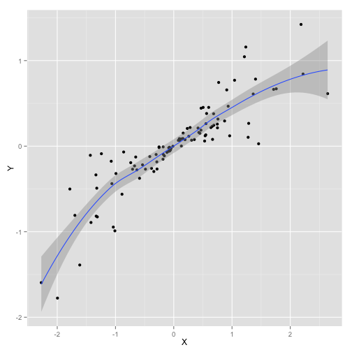
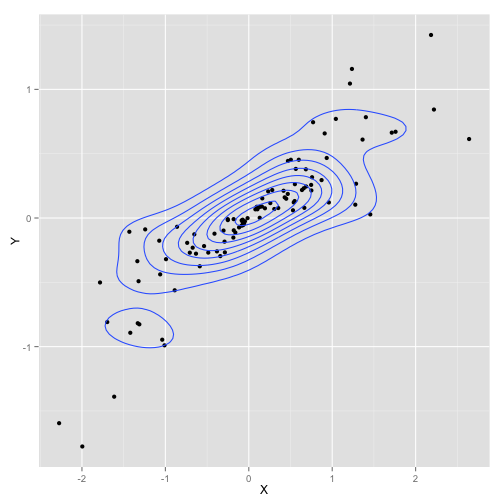

Open Access Statistics 
========================================================

<div style="font-size: 2em; line-height: 100%;"> 
Dynamic Documents, <br /> Literate Programming, and Reproducible Research with R
</div>
<br><br>
<div style="font-size: 1em;">
 Kevin M. Smith <br>
 December 9th, 2014
</div>

What is R?
========================================================
<iframe src="http://en.m.wikipedia.org/wiki/R_(programming_language)" height="1200px" width="100%"></iframe>


Definitions
========================================================
- Dynamic Documents
  - input and output are linked
  - a change in the input propogates through the document 
- Literate Programming
  - the practice of interleaving __natural languages__ and __programming languages__ in such a way that the program still runs

Definitions, ctd.
========================================================
- Reproducible Research _(especially for computational experiments)_
  - an emerging set of best practices, including __open and complete documentation of data sets and code__, documenting computational environments, random number generator seeds, etc.

Literate Programming Example
========================================================
$$ X \sim N(0, 1)$$
$$ B \sim U(0, 1) $$
$$ Y \equiv B \cdot X $$


```r
X = rnorm(100)
B = runif(100)
Y = X * B
cor(X, Y)
```

```
[1] 0.8760154
```
<br>
### __Query:__
Is the relationship $Y = f(X)$ linear? 

Build the Plot
========================================================
Import

```r
library(ggplot2); 
data = data.frame(X = X, Y = Y)
```

Base Layer

```r
base <- ggplot(data, aes(x = X, y = Y))
```

Scatterplot Layer

```r
g <- base + geom_point()
```

Scatterplot
========================================

```r
g
```


Add LOESS Smooth
========================================

```r
g + geom_smooth()
```



Density Estimation
========================================

```r
g + stat_density2d()
```



================
<a href="http://kevin-m-smith.github.io/CEE202/Correlation/Spurious" target="_blank">Example Vignette</a>
<iframe src="http://kevin-m-smith.github.io/CEE202/Correlation/Spurious" width="1200px" height="1200px"></iframe>

================
<a href="http://kevin-m-smith.github.io/BDA2014/TimeSeriesAnalysis/" target="_blank">Example Tutorial</a>
<iframe src="http://kevin-m-smith.github.io/BDA2014/TimeSeriesAnalysis/" width="1200px" height="1200px"></iframe>

Questions? Feedback?
================
<br>
<br>
<br>
<br>
<div style="font-size: 3em;"> Thank you! </div>

