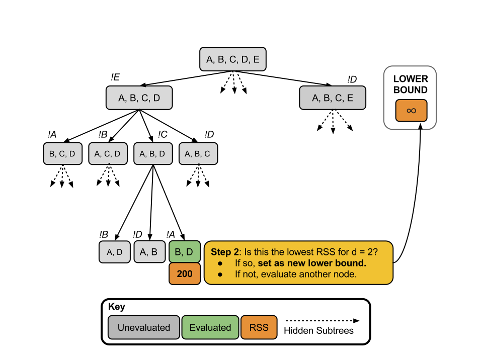
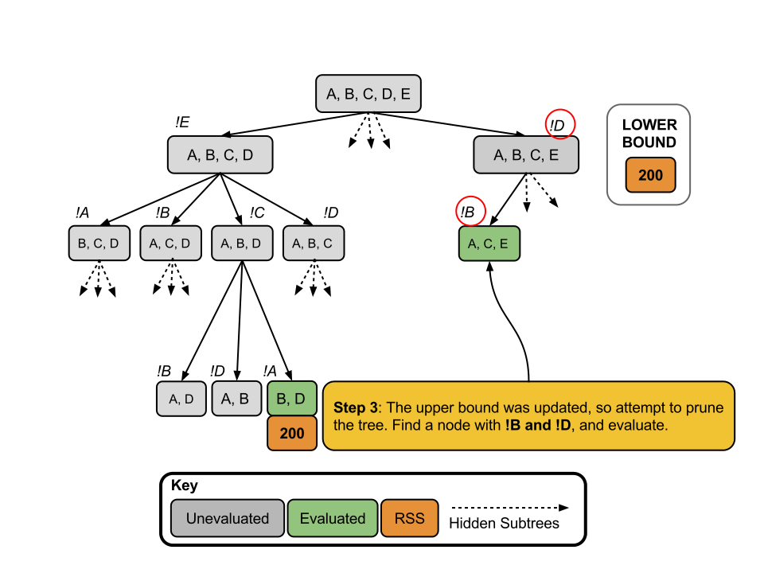

<script type="text/javascript" src="js/jquery.min.js"></script>
<script type="text/javascript" src="js/jquery-ui.min.js"></script>
<script type="text/javascript" src="js/jquery.fancybox-1.3.4.pack.min.js"></script>
<script type="text/javascript" src="js/jquery.tocify.js"></script>
<script type="text/javascript" src="js/jquery.scianimator.min.js"></script>
<script type="text/javascript" src="js/page.js"></script>
<script>  </script>
<link type="text/css" rel="stylesheet" href="css/jquery.tocify.css" />
<link type="text/css" rel="stylesheet" media="screen" href="css/jquery.fancybox-1.3.4.css" />
<link type="text/css" rel="stylesheet" href="css/style.css"
<head> <div id="tableofcontents"></div> </head>
<div id="source" class="tocify"> 
<ul class="tocify-header nav nav-list">
<li class="tocify-item active" style="cursor: pointer;">
<a onclick='toggle_R();' >Show / Hide Source</a>
</li></ul>
</div>

__Kevin M. Smith // Environmental Statistics // Fall 2014__
<hr>
```{r, warning=FALSE, message=FALSE, results='hide'}
library(knitr)
library(ggplot2)
library(xtable)
library(gridExtra)
library(pander)

opts_knit$set(fig.width = 10,
              xtable.type = 'html',
              warning = FALSE,
              cache = TRUE,
              dev = 'png')


options(xtable.comment = FALSE)
panderOptions('table.split.table', Inf)
```

# Overview
The purpose of this short note is to introduce the __branch and bound__ method for __exhaustive subsetting of predictor variables in multivariate linear regression__. Those familiar with integer programming may also be familiar with branch and bound techniques, as they are widely used. This note will not explore low-level algorithmic details (which vary widely) but instead convey the basic theory and general results of the application of branch and bound techniques. 

# The Subsetting Problem
## The $R^2$ Ratchet
Here we are concerned with estimating the mean of the vector $y = X\beta + \epsilon$ where $X$ is a $n$ by $p$ design matrix. In general, increasing $p$ (the number of predictors) relative to $n$ (the number of observations) will reduce the residual sum of square errors, $RSS = \sum_i^n (y_i - \hat{y})$ and increase the coefficient of determination $R^2$. In fact, __RSS will never increase__ and __the $R^2$ never decrease__ with an additional predictor $X_{p+1}$, regardless of wheter or not the new predictor $X_{p+1}$ is a cuasal driver of $y$ or just random noise. [See the _Vignette_ on the $R^2$ ratchet for more details.](http://kevin-m-smith.github.io/CEE202/Regression/TheRatchet/) 

## Best Subsets
One method to account for the effects of the number of predictors ($p$) on the in-set predictive capability is simply to enumerate the $k$ best models for each subset of $d$ predictors where $d \le p$ so the trade-offs can be assessed directly. However, as the number of models to evaluate grows quickly with $p$, the upper bound on $d$. Specifically, at each level $d$ there are $\tbinom pd$ models. 

```{r}
library(ggplot2)
#p == 5
p3 <- rep("3", 9)
x3 <- c(1:3, rep(NA, 6))
y3 <- c(choose(3, x3))

#p == 5
p5 <- rep("5", 9)
x5 <- c(1:5, NA, NA, NA, NA)
y5 <- c(choose(5, x5))

#p == 7
p7 <- rep("7", 9)
x7 <- c(1:7, NA, NA)
y7 <- c(choose(7, x7))

# p == 9
p9 <- rep("9", 9)
x9 <- 1:9
y9 <- choose(9, x9)


df <- data.frame(x = c(x3, x5, x7, x9), 
                 y = c(y3, y5, y7, y9), 
                 p = c(p3, p5, p7, p9))

p <- ggplot(df, aes(x = x, y = y, color = p)) + 
  geom_line(lwd = 2) + scale_y_log10() + 
  scale_x_continuous(breaks = round(seq(1, 9, by = 1),0)) + 
  ggtitle("Number of Models to Evaluate at Each Subset Level (d) as a Function of Predictors (p).") + 
  ylab("Number of Models to Evaluate") +
  xlab("Subset Level (d)")

p

```

# Branch and Bound
__Furnival and Wilson__,

## Step-wise Example

### Step 1


### Step 2


### Step 3


### Step 4


### Step 5


