# Vignette: Branch and Bound
  
  

<script type="text/javascript" src="js/jquery.min.js"></script>
<script type="text/javascript" src="js/jquery-ui.min.js"></script>
<script type="text/javascript" src="js/jquery.fancybox-1.3.4.pack.min.js"></script>
<script type="text/javascript" src="js/jquery.tocify.js"></script>
<script type="text/javascript" src="js/jquery.scianimator.min.js"></script>
<script type="text/javascript" src="js/page.js"></script>
<script>  </script>
<link type="text/css" rel="stylesheet" href="css/jquery.tocify.css" />
<link type="text/css" rel="stylesheet" media="screen" href="css/jquery.fancybox-1.3.4.css" />
<link type="text/css" rel="stylesheet" href="css/style.css"
<head> <div id="tableofcontents"></div> </head>
<div id="source" class="tocify"> 
<ul class="tocify-header nav nav-list">
<li class="tocify-item active" style="cursor: pointer;">
<a onclick='toggle_R();' >Show / Hide Source</a>
</li></ul>
</div>

__Kevin M. Smith // Environmental Statistics // Fall 2014__
<hr>

```r
library(knitr)
library(ggplot2)
library(xtable)
library(gridExtra)
library(pander)

opts_knit$set(fig.width = 10,
              xtable.type = 'html',
              warning = FALSE,
              cache = TRUE,
              dev = 'png')


options(xtable.comment = FALSE)
panderOptions('table.split.table', Inf)
```

# Overview
The purpose of this short note is to introduce the __branch and bound__ method for __exhaustive subsetting of predictor variables in multivariate linear regression__. Those familiar with integer programming may also be familiar with branch and bound techniques, as they are widely used. This note will not explore low-level algorithmic details (which vary widely) but instead convey the basic theory and general results of the application of branch and bound techniques. 
<br><br>
<hr>

# The Subsetting Problem
## The $R^2$ Ratchet
Here we are concerned with estimating the mean of the vector $y = X\beta + \epsilon$ where $X$ is a $n$ by $p$ design matrix. In general, increasing $p$ (the number of predictors) relative to $n$ (the number of observations) will reduce the residual sum of square errors, $RSS = \sum_i^n (y_i - \hat{y})$ and increase the coefficient of determination $R^2$. In fact, __RSS will never increase__ and __the $R^2$ never decrease__ with an additional predictor $X_{p+1}$, regardless of whether or not the new predictor $X_{p+1}$ is a causal driver of $y$ or just random noise. [See the _Vignette_ on the $R^2$ ratchet for more details.](http://kevin-m-smith.github.io/CEE202/Regression/TheRatchet/) 

## Best Subsets
One method to account for the effects of the number of predictors ($p$) on the in-set predictive capability is simply to enumerate the $k$ best models for each subset of $d$ predictors where $d \le p$ so the trade-offs can be assessed directly. However, as the number of models to evaluate grows quickly with $p$, the upper bound on $d$. Specifically, at each level $d$ there are $\tbinom pd$ models. 
<br><br>
Consider the case where $p = 12$, and the objective is to solve for the best model at each level $d \in 1...P$ A brute force search would require evaluating all $\sum_{i=1}^{12} \tbinom {12}{i} = 4095$ models. With modern computers, this is feasible in a reasonable time frame. However, if $p$ is increased by 50% to 18 predictors, the total number of models becomes $\sum_{i=1}^{18} \tbinom {18}{i} = 2.62143\times 10^{5}$. Clearly things get out of hand pretty quickly. 


```r
library(ggplot2)
#p == 5
p3 <- rep("3", 9)
x3 <- c(1:3, rep(NA, 6))
y3 <- c(choose(3, x3))

#p == 5
p5 <- rep("5", 9)
x5 <- c(1:5, NA, NA, NA, NA)
y5 <- c(choose(5, x5))

#p == 7
p7 <- rep("7", 9)
x7 <- c(1:7, NA, NA)
y7 <- c(choose(7, x7))

# p == 9
p9 <- rep("9", 9)
x9 <- 1:9
y9 <- choose(9, x9)


df <- data.frame(x = c(x3, x5, x7, x9), 
                 y = c(y3, y5, y7, y9), 
                 p = c(p3, p5, p7, p9))

p <- ggplot(df, aes(x = x, y = y, color = p)) + 
  geom_line(lwd = 2) + scale_y_log10() + 
  scale_x_continuous(breaks = round(seq(1, 9, by = 1),0)) + 
  ggtitle("Number of Models to Evaluate at Each Subset Level (d) as a Function of Number of Predictors (p).") + 
  ylab("Number of Models to Evaluate") +
  xlab("Subset Level (d)")

p
```

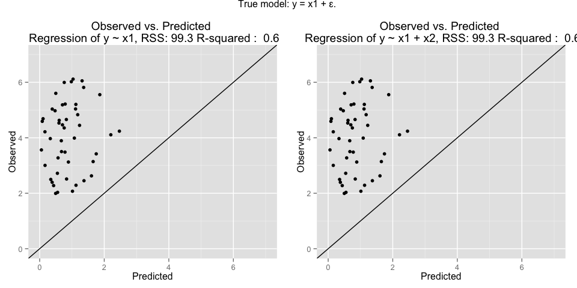 

## Branch and Bound
In 1974 __Furnival and Wilson__ first applied __branch and bound__ methods to subset selection. The key to applying branch and bound methods was the identification of an criterion function that guaranteed that for every super-set-subset relationship $S_a \supset S_b$, the value of the criteria function $J(a) \le J(b)$. In this way, an optimal solution can be found without evaluating all possible models. The ratcheting effect of the residual sum of squared errors (RSS) makes it an excellent candidate for the criteria function. With the addition of a predictor $X_{p+1}$ to set $S_p$, it follows that $RSS(S_{p+1}) \le RSS(S_{p})$
<br><br>
By using the criteria function, the branch and bound algorithm can often eliminate vast swaths of models that are known to have sub-optimal solutions. The branch and bound method uses a [tree](http://en.wikipedia.org/wiki/Tree_(set_theory)) where the top node is the model with all the predictors, i.e. $d = p$. From that node, each combination of $d = (p-1)$ is branched recursively until the leaf nodes are at the desired minimum level of sub-setting. For each sub-level $d$ the minimum value of RSS is recorded as the __lower bound__. For a given node $a$ with branches $b1$ and $b2$ the sub-setting is $S_a \supset S_{b1} \supset S_{c1}$ and $S_a \supset S_{b2} \supset S_{c2}$. If the algorithm evaluates $\S_{c1}$ at level $d$ and finds it has a lower RSS than $\S_{b2}$ at level $d+1$, it follows immediately that $RSS(S_{c1}) \lt RSS(S_{b2} \lt S_{c2})$. Therefore none of the children of $S_{b2}$ need to be evaluated as candidates for the best models in subset $d$ - they can simply be dropped. Diagrams can be infinitely more useful in understanding this process - so a worked example follows. 
<br><br>
<hr>
# Step-wise Example

 * In this example there are 5 predictors, i.e. $p = 5$. The predictors are labeled A, B, C, D, E.
 * For simplicity, assume only the single ($k = 1$) best subset at level $d = 2$ is desired. 
    * _As a consequence the algorithm is only keeping track of the lower bound on RSS for level $d = 2$_. 
 * The __'!'__ in front of a letter indicates the predictor with that letter is __NOT__ in the subtree. 
 * No particular heuristics are used here - the algorithm is naive. 
 * This example only shows a possible first sweep of the tree, which would continue repetitively until the optimal solution is found. 

## Step 1
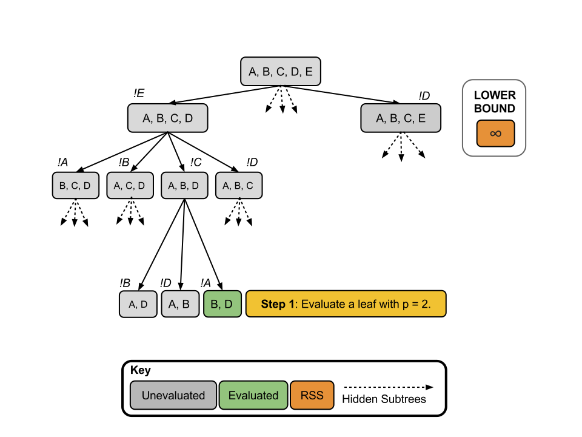

## Step 2
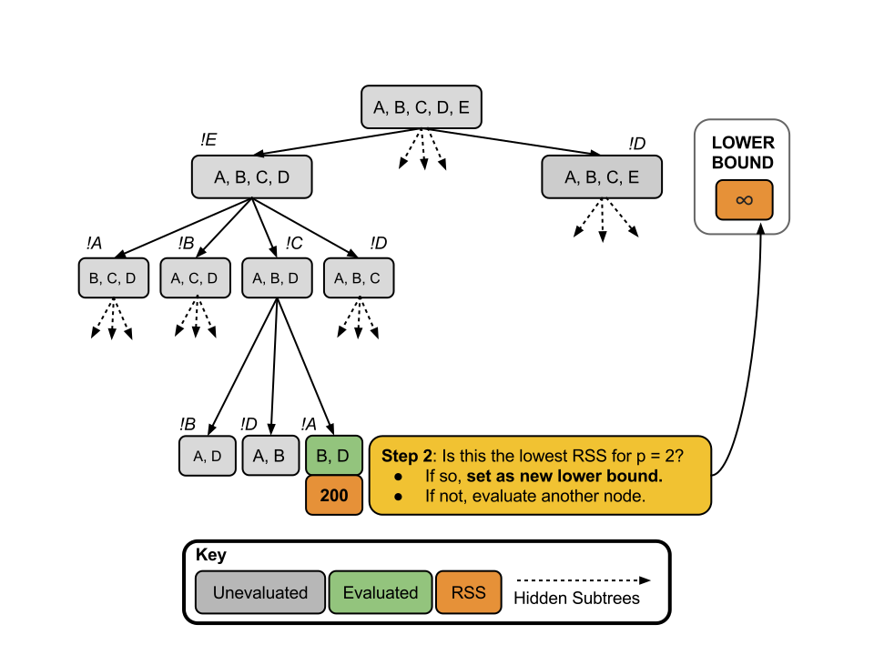

## Step 3
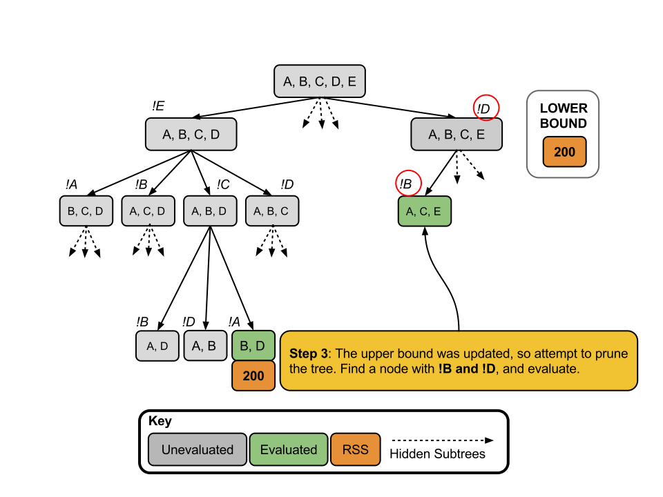

## Step 4
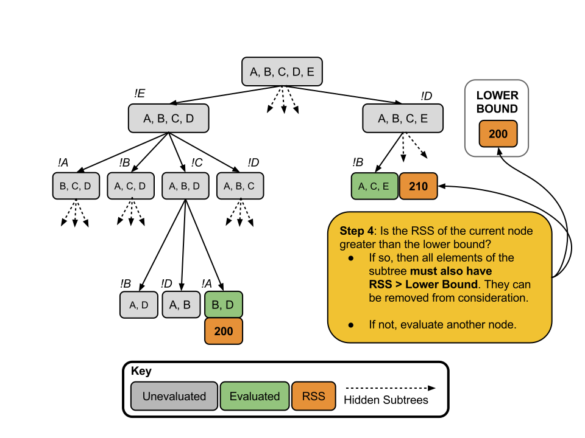

## Step 5
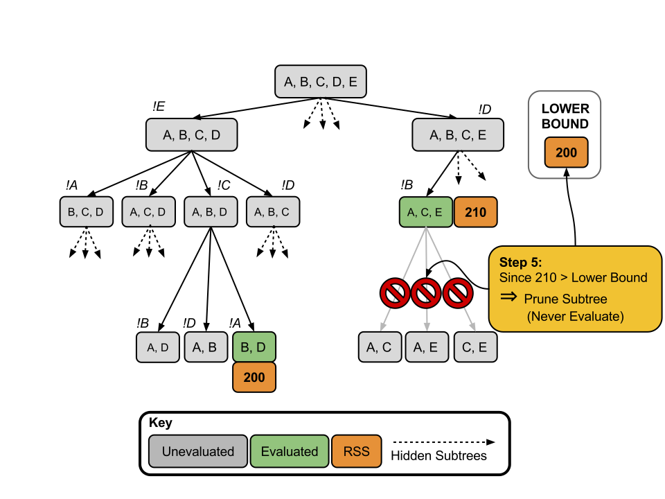

__Here by evaluating _two_ models, we have eliminated _three_. In this case it is a small victory, but the results can be much more dramatic as $p$ grows large__. 

<hr>
<br>

# RSS Criterion: Perks & Pitfalls

## Perks
While the effect of linear regression is to find parameters that minimize the RSS, the actual value of the RSS is not informative in the absence of other context. Generally, statistics such as $R^2$ the adjusted $R^2$ are used to provide a more stand-alone description of the model performance. Fortunately, the $R^2$ and the adjusted $R^2$ are both monotonic functions of RSS within a given sub-level of the predictor space $d$. This follows directly from their definitions: $R^2 = 1 - \frac{RSS}{\sum_i^n(y_i - \bar{y})^2}$ and the adjusted $R^2$, $\bar{R}^2 \equiv 1 - (1 - R^2)\frac{n-1}{n-p-1}$. As a consequence, minimizing the RSS at a given $d$ is equivalent to maximizing $R^2$ and the adjusted $R^2$ at that level (see __Funival and Wilson__, page 499).

## Pitfalls
There is a push to move away from measures that rely on the residual sum of squared errors (RSS), since it doesn't provide a measure of the out-sample predictive capacity. Specifically, it may often be more to care more about the the $R_{pred}^2$ [(discussed in detail here)](http://kevin-m-smith.github.io/CEE202/Regression/TheRatchet/) than the $\bar{R}^2$ for example. Instead of RSS, $R_{pred}^2$ is a monotonic function of PRESS. However, PRESS does not serve well as a criteria function because it makes no guarantee that the addition of a predictor $X_{p+1}$ to set $S_p$ will result in $PRESS(S_{p+1}) \le PRESS(S_{p})$. 
<br>
__As it turns out, the often vexing ratcheting effect of RSS is what makes it useful in this instance__. As a result, there is currently no computationally efficient means of exhaustively evaluating models on the basis of PRESS. 

## Example: Random Noise Models

For this experiment all of the observations and the predictors are independent uniformly distributed random variables, $\mathbb{R} \in [1, 5]$, $x \sim U(1, 5)$. 


```r
require(leaps)

set.seed(100)


calculate.stats <- function(z, y, x){
  np <- sum(z)
  x <- as.matrix(x[,which(z)])
  fit <- lm(y~x)
  PRESS <- sum( (resid(fit)/(1-hatvalues(fit)))^2 )
  Sqs <- anova(fit)$`Sum Sq`
  PR2 <- 1 - (PRESS / sum(Sqs))
  t(c(np, PR2, Sqs[2], summary(fit)$r.squared, summary(fit)$adj.r.squared, PRESS))
}

experiment <- function(){
  y <- runif(100)
  
  x <- data.frame(x0 = runif(100),
                  x1 = runif(100),
                  x2 = runif(100),
                  x3 = runif(100),
                  x4 = runif(100),
                  x5 = runif(100),
                  x6 = runif(100),
                  x7 = runif(100),
                  x8 = runif(100),
                  x9 = runif(100),
                  xA = runif(100),
                  xB = runif(100),
                  xC = runif(100))
  
  t <- regsubsets(x = x, y = y, nbest = 1716, nvmax = 13, really.big = T)
  
  whc <- summary(t, matrix.logical = TRUE)$outmat
  
  result <- apply(whc, 1, calculate.stats, y, x)  
}

a <- t(experiment())      # Run Experiment
a <- data.frame(np = a[,1], pred.r2 = a[,2], # Restructure Results
                RSS = a[,3], r2 = a[,4], adj.r2 = a[,5], PRESS = a[,6])
```


```r
g <- ggplot(a, aes(x = RSS, y = r2, color = as.factor(np))) + 
  geom_point() + ylab("R-squared") +
  ggtitle("R-squared is a Monotone Function of RSS") + 
  scale_color_discrete(name = "Number of Random Noise Predictors") +
  theme(legend.position = "bottom")
g
```

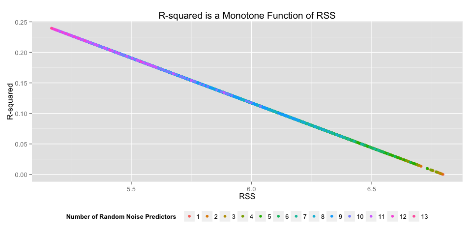 
 
> The plot above demonstrates the ratcheting effect of RSS when adding an additional predictor, even if it is pure noise. It also shows the monotonicity of $R^2$ with RSS. 
 


```r
g <- ggplot(a, aes(x = RSS, y = adj.r2, color = as.factor(np))) + 
  geom_point() + ylab("Adjusted R-squared") +
  ggtitle("Adjusted R-squared is a Monotone Function of RSS \n with Bandgaps Between Parameterization Levels") + 
  scale_color_discrete(name = "Number of Random Noise Predictors") +
  theme(legend.position = "bottom")
g
```

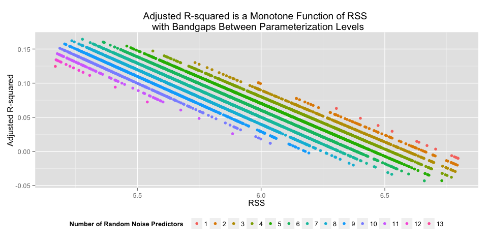 
 
> The above plot shows the penalization on $\bar{R}^2$ of adding an additional predictor $x_{p+1}$ as a rigid bandgap. It also clearly shows the monotonicity of $\bar{R}^2$ with RSS. 
 


```r
g <- ggplot(a, aes(x = RSS, y = pred.r2, color = as.factor(np))) + 
  geom_point() + ylab("Prediction R-squared") +
  ggtitle("Prediction R-squared is NOT Monotone Function of RSS \n but it has (Noisey) Bandgaps Between Parameterization Levels") + 
  scale_color_discrete(name = "Number of Random Noise Predictors") +
  theme(legend.position = "bottom")
g
```

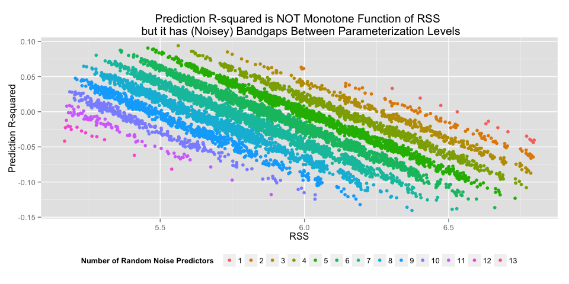 
 
> The plot above also shows bandgap features as a function of the number of predictors, but they are not clean breaks as they are with $\bar{R}^2$. The plot also demonstrates that $R_{pred}^2$ is _NOT_ a monotonic function of RSS, but of PRESS. Recall that $R_{pred}^2$ is a function of [PRESS](http://en.wikipedia.org/wiki/PRESS_statistic). The monotonicity of $R_{pred}^2$ with PRESS and the relationship PRESS and RSS are shown in the following plots.  
 
 

```r
g <- ggplot(a, aes(x = PRESS, y = pred.r2, color = as.factor(np))) + 
  geom_point() + ylab("Prediction R-squared") +
  ggtitle("Prediction R-squared is a Monotone Function of PRESS \n  with Bandgaps Between Parameterization Levels") + 
  scale_color_discrete(name = "Number of Random Noise Predictors") +
  theme(legend.position = "bottom")
g
```

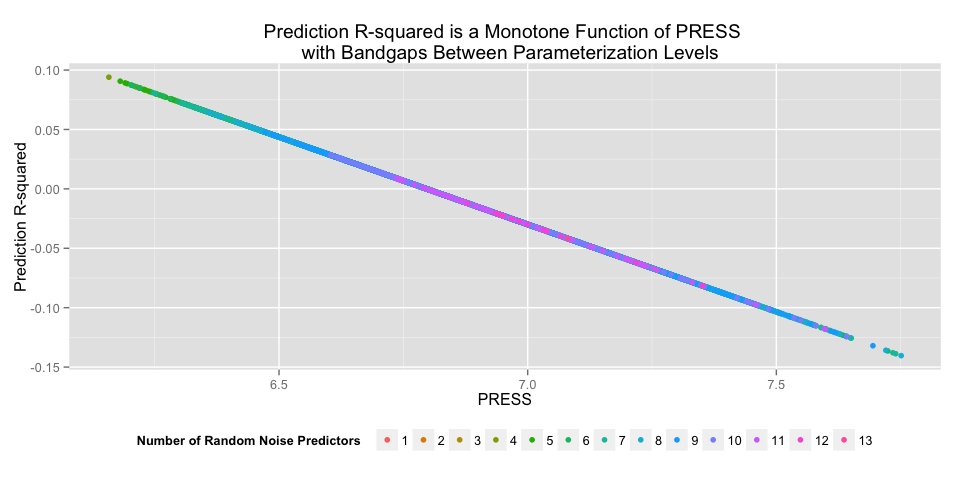 


```r
g <- ggplot(a, aes(x = RSS, y = PRESS, color = as.factor(np))) + 
  geom_point() + 
  ggtitle("PRESS vs. RSS") + 
  scale_color_discrete(name = "Number of Random Noise Predictors") +
  theme(legend.position = "bottom")
g
```

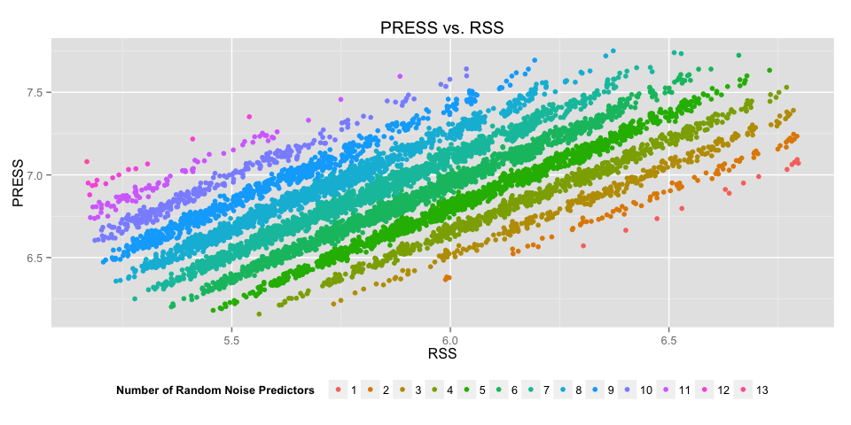 

# Appendix

## References 

G. M. Furnival and R. W. Wilson, “Regressions by Leaps and Bounds,” Technometrics, vol. 16, no. 4, pp. 499–511, Nov. 1974.

## Reproducibility Information


```r
pander(sessionInfo())
```

**R version 3.1.2 (2014-10-31)**

**Platform:** x86_64-apple-darwin13.4.0 (64-bit) 

**locale:**


**attached base packages:** 
[1] "_grid_, _stats_, _graphics_, _grDevices_, _utils_, _datasets_, _methods_ and _base_" attr(,"class") [1] "knit_asis" attr(,"knit_cacheable") [1] TRUE

**other attached packages:** 
[1] "_pander(v.0.5.1)_, _gridExtra(v.0.9.1)_, _xtable(v.1.7-4)_, _ggplot2(v.1.0.0)_ and _knitr(v.1.8)_" attr(,"class") [1] "knit_asis" attr(,"knit_cacheable") [1] TRUE

**loaded via a namespace (and not attached):** 
[1] "_colorspace(v.1.2-4)_, _digest(v.0.6.4)_, _evaluate(v.0.5.5)_, _formatR(v.1.0)_, _gtable(v.0.1.2)_, _htmltools(v.0.2.6)_, _labeling(v.0.3)_, _MASS(v.7.3-35)_, _munsell(v.0.4.2)_, _plyr(v.1.8.1)_, _proto(v.0.3-10)_, _Rcpp(v.0.11.3)_, _reshape2(v.1.4)_, _rmarkdown(v.0.3.10)_, _scales(v.0.2.4)_, _stringr(v.0.6.2)_, _tools(v.3.1.2)_ and _yaml(v.2.1.13)_" attr(,"class") [1] "knit_asis" attr(,"knit_cacheable") [1] TRUE


