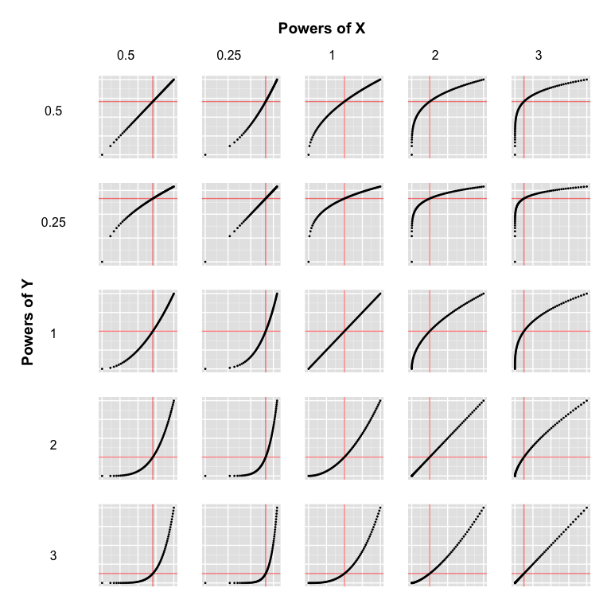
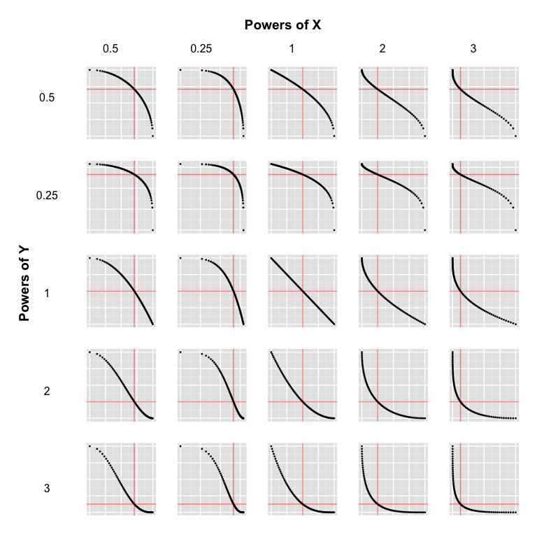

# Vignette: Tukey's Bulging Rule
  
  

<script type="text/javascript" src="js/jquery.min.js"></script>
<script type="text/javascript" src="js/jquery-ui.min.js"></script>
<script type="text/javascript" src="js/jquery.fancybox-1.3.4.pack.min.js"></script>
<script type="text/javascript" src="js/jquery.tocify.js"></script>
<script type="text/javascript" src="js/jquery.scianimator.min.js"></script>
<script type="text/javascript" src="js/page.js"></script>
<script>  </script>
<link type="text/css" rel="stylesheet" href="css/jquery.tocify.css" />
<link type="text/css" rel="stylesheet" media="screen" href="css/jquery.fancybox-1.3.4.css" />
<link type="text/css" rel="stylesheet" href="css/style.css"
<head> <div id="tableofcontents"></div> </head>
<div id="source" class="tocify"> 
<ul class="tocify-header nav nav-list">
<li class="tocify-item active" style="cursor: pointer;">
<a onclick='toggle_R();' >Show / Hide Source</a>
</li></ul>
</div>

__Kevin M. Smith // Environmental Statistics // Fall 2014__
<hr>

```r
library(knitr)
library(ggplot2)
library(gridExtra)
library(pander)

opts_knit$set(fig.width = 8,
              fig.height = 8,
              xtable.type = 'html',
              warning = FALSE,
              cache = TRUE,
              dev = 'png')


options(xtable.comment = FALSE)
panderOptions('table.split.table', Inf)
```

# Overview
The purpose of this vignette is to demonstrate Tukey's bulging rule for the linearization of data. [John Tukey](http://en.wikipedia.org/wiki/John_Tukey), made uncountable contributions to the domains of mathematics and statistics. You should not remember him for this diagram, but the diagram is worth remembering (or at least keeping handy).

<br>
<hr>
# Static View

This is a new take on the typical _bulging_ diagram. It only considers power transformations, but it also shows how the data is _stretched_ and _squished_ during transformation. The median for each variable is plotted as a red line. To use the diagram, identify the shape of the data in the plot most like your own. Now read off the powers of $x$ and $y$ and apply their respective inverses. With any luck, you'll end up with a picture that looks closer to the center image. Recurse or undo as necessary. No guarantees.

## Diagram for $\rho(x, y) > 0$
<br>

```r
require(gridExtra)
require(ggplot2)

xp = c(0.5, 0.25, 1, 2, 3)
yp = c(0.5, 0.25, 1, 2, 3)

simple.transform <- function(z){
  xp = z[1]
  yp = z[2]
  return(data.frame(
    xp,
    yp,
    x = seq(0, 100, length.out = 75)^xp,
    y = seq(0, 100, length.out = 75)^yp
  ))
}

simple <- expand.grid(xp = xp, yp = yp)

res <- apply(simple, 1, simple.transform)


plotter <- function(i){
  g <- ggplot(res[[i]], aes(x = x, y = y))
  g <- g + geom_vline(aes(xintercept = median(x)), col = "red", alpha = 0.5) 
  g <- g + geom_hline(aes(yintercept = median(y)), col = "red", alpha = 0.5)
  g <- g + xlab("") + ylab("")
  g <- g + geom_point(size = 1) + theme(axis.text.x = element_blank(), 
                                        axis.text.y = element_blank(),
                                        axis.ticks = element_blank(),
                                        plot.margin = unit(c(0, 0, 0, 0), "cm"))
  g 
}


yg <- do.call(arrangeGrob, args = c(lapply(yp, textGrob), nrow = 5))
xg <- do.call(arrangeGrob, args = c(lapply(xp, textGrob), ncol = 5))
p <- do.call(arrangeGrob, args = lapply(1:25, plotter))
lhs <- arrangeGrob(textGrob(""), yg, heights = c(0.2,5))
rhs <- arrangeGrob(xg, p, nrow = 2, heights = c(0.4,5))
f <- arrangeGrob(lhs, rhs, textGrob(""), ncol = 3, widths = c(0.4,5,0.2), 
                 left = textGrob("\nPowers of Y", 
                                 gp = gpar(cex = 1.2, fontface = "bold"), rot = 90),
                 main = textGrob("\nPowers of X", 
                                 gp = gpar(cex = 1.2, fontface = "bold")))

f
```

 
<br><hr>
## Diagram for $\rho(x, y) < 0$

```r
simple.transform <- function(z){
  xp = z[1]
  yp = z[2]
  return(data.frame(
    xp,
    yp,
    x = seq(0, 100, length.out = 75)^xp,
    y = seq(100, 0, length.out = 75)^yp
  ))
}

simple <- expand.grid(xp = xp, yp = yp)

res <- apply(simple, 1, simple.transform)

yg <- do.call(arrangeGrob, args = c(lapply(yp, textGrob), nrow = 5))
xg <- do.call(arrangeGrob, args = c(lapply(xp, textGrob), ncol = 5))
p <- do.call(arrangeGrob, args = lapply(1:25, plotter))
lhs <- arrangeGrob(textGrob(""), yg, heights = c(0.2,5))
rhs <- arrangeGrob(xg, p, nrow = 2, heights = c(0.4,5))
f <- arrangeGrob(lhs, rhs, textGrob(""), ncol = 3, widths = c(0.4,5,0.2), 
                 left = textGrob("\nPowers of Y", 
                                 gp = gpar(cex = 1.2, fontface = "bold"), rot = 90),
                 main = textGrob("\nPowers of X", 
                                 gp = gpar(cex = 1.2, fontface = "bold")))

f
```

 
<br>
<hr>

# Interactive Transform Tool
I have developed an interactive tool that helps visualize the transformations on $x$ and $y$. It is available [here](http://kevin-m-smith.github.io/CEE202/Regression/SimpleTransformTool/).

<hr>
# Appendix

## References 

D. C. Hoaglin, “John W. Tukey and Data Analysis,” Statistical Science, vol. 18, no. 3, pp. pp. 311–318, 2003.

## Reproducibility Information


```r
pander(sessionInfo())
```

**R version 3.1.2 (2014-10-31)**

**Platform:** x86_64-apple-darwin13.4.0 (64-bit) 

**locale:**


**attached base packages:** 
[1] "_grid_, _stats_, _graphics_, _grDevices_, _utils_, _datasets_, _methods_ and _base_" attr(,"class") [1] "knit_asis" attr(,"knit_cacheable") [1] TRUE

**other attached packages:** 
[1] "_pander(v.0.5.1)_, _gridExtra(v.0.9.1)_, _ggplot2(v.1.0.0)_ and _knitr(v.1.8)_" attr(,"class") [1] "knit_asis" attr(,"knit_cacheable") [1] TRUE

**loaded via a namespace (and not attached):** 
[1] "_colorspace(v.1.2-4)_, _digest(v.0.6.4)_, _evaluate(v.0.5.5)_, _formatR(v.1.0)_, _gtable(v.0.1.2)_, _htmltools(v.0.2.6)_, _labeling(v.0.3)_, _MASS(v.7.3-35)_, _munsell(v.0.4.2)_, _plyr(v.1.8.1)_, _proto(v.0.3-10)_, _Rcpp(v.0.11.3)_, _reshape2(v.1.4)_, _rmarkdown(v.0.3.10)_, _scales(v.0.2.4)_, _stringr(v.0.6.2)_, _tools(v.3.1.2)_ and _yaml(v.2.1.13)_" attr(,"class") [1] "knit_asis" attr(,"knit_cacheable") [1] TRUE


