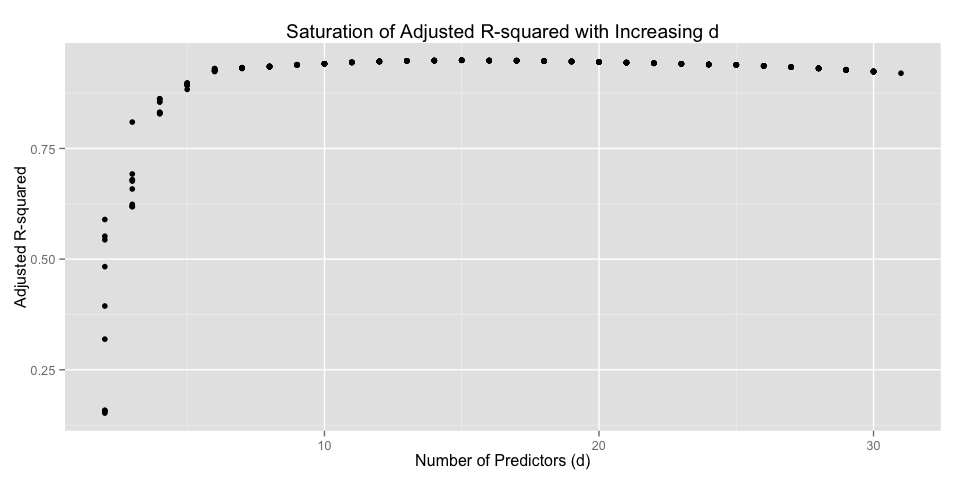
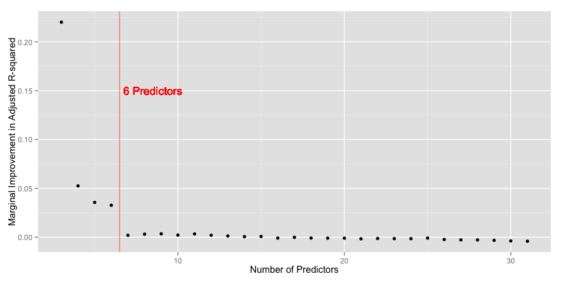
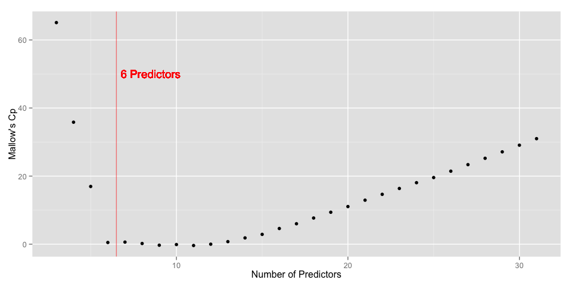
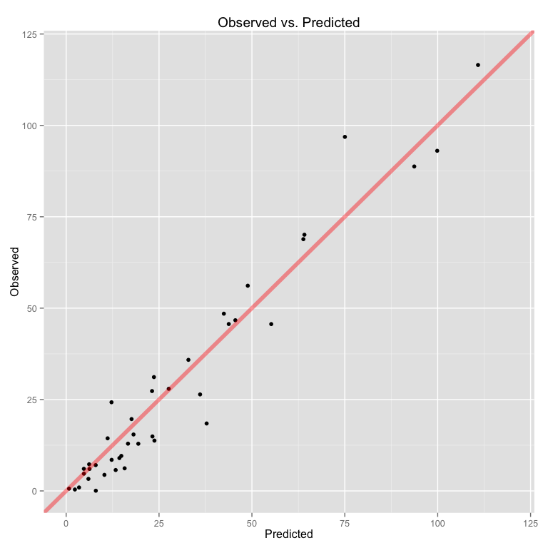

# Vignette: Leaps and Bounds
  
  

<script type="text/javascript" src="js/jquery.min.js"></script>
<script type="text/javascript" src="js/jquery-ui.min.js"></script>
<script type="text/javascript" src="js/jquery.fancybox-1.3.4.pack.min.js"></script>
<script type="text/javascript" src="js/jquery.tocify.js"></script>
<script type="text/javascript" src="js/jquery.scianimator.min.js"></script>
<script type="text/javascript" src="js/page.js"></script>
<script>  </script>
<link type="text/css" rel="stylesheet" href="css/jquery.tocify.css" />
<link type="text/css" rel="stylesheet" media="screen" href="css/jquery.fancybox-1.3.4.css" />
<link type="text/css" rel="stylesheet" href="css/style.css"
<head> <div id="tableofcontents"></div> </head>
<div id="source" class="tocify"> 
<ul class="tocify-header nav nav-list">
<li class="tocify-item active" style="cursor: pointer;">
<a onclick='toggle_R();' >Show / Hide Source</a>
</li></ul>
</div>
__Kevin M. Smith // Environmental Statistics // Fall 2014__


<hr>
# Overview
The intention of this note is to demonstrate exhaustive subset regression using the $leaps$ package available in the _R_ programming language. _Leaps_ is a homage to the title of the 1974 paper _Regressions by Leaps and Bounds_ by __Furnival and Wilson__. In their manuscript Furnival and Wilson demonstrate how __branch and bound__ techniques common to integer programming can be re-purposed to provide a computationally tractable method of finding the globally optimal model (in terms of minimized RSS) for a given subset size $d$ of $p$ total predictors. I have written about the branch and bound method for best subsets regressions in another vignette, available [here](http://kevin-m-smith.github.io/CEE202/Regression/BranchAndBound/). 
<hr>

# Data Manipulation
## Reading in The Data Set

```r
data <- read.csv("data/hydro.csv", header = TRUE)
pander(head(data))
```


---------------------------------------------------
 Site    State   LatN   LonW   Q710   Area   Slopw 
------- ------- ------ ------ ------ ------ -------
1010000   ME    46.42  69.43  93.05   1341   5.81  

1022500   ME    44.36  67.56  31.14   227    10.94 

1030500   ME     45.3  68.18  70.09   1418   4.07  

1031500   ME     45.1  69.19  18.45   298    26.45 

1033500   ME    45.17    69   48.49   324    33.85 

1035000   ME    45.11  68.28  46.69   299    10.54 
---------------------------------------------------

Table: Table continues below

 
---------------------------------------------------
 Length   Elev   Precip   Intensity   Janmin   BFI 
-------- ------ -------- ----------- -------- -----
   70     1470   40.23       2.2        32    0.487

  38.4    320    41.98       3.2      33.98   0.55 

  88.4    570    39.25       2.7      33.08   0.577

  36.6    1050   42.24       3.1      33.26   0.471

  38.8    1150   43.35       3.1      33.26   0.542

  22.2    420    40.05        3       33.26   0.725
---------------------------------------------------
 
## Seperating Observations and Predictors

```r
y <- as.vector(unlist(data["Q710"]))
exclude <- names(data) %in% c("Site", "State", "Q710") 
x <- data[!exclude]
```

## Augmenting the Observations with Transforms

```r
square <- function(x){ x * x }

Log <- adply(x, 1, log)
colnames(Log) <- paste("Log", names(Log), sep = "")
Sq <- adply(x, 1, square)
colnames(Sq) <- paste("Sq", names(Sq), sep = "")

x <- data.frame(x, Log, Sq) 
```

# A Hop, Skip, and a Leap

## Load the Leaps Package

```r
require(leaps)
```

## Exhaustive Search

```r
best <- leaps(x = x, y = y, nbest = 10, method = "adjr2")
```

That's it. Sit back and let the 30-year-old FORTRAN libraries do the rest.

# Graphical Presentation

## Adjusted $R^2$ vs. $d$

```r
results <- data.frame(number.of.predictors = best$size,
                      adjusted.r2 = best$adjr2)

ggplot(results, aes( x = number.of.predictors, y = adjusted.r2)) + 
  geom_point() +
  ggtitle("Saturation of Adjusted R-squared with Increasing d") +
  ylab("Adjusted R-squared") + 
  xlab("Number of Predictors (d)")
```

 

## $\Delta$ Adjusted $R^2$ vs. $d$

```r
best <- leaps(x = x, y = y, nbest = 1, method = "adjr2")

results <- data.frame(number.of.predictors = best$size[2:30],
                      marginal.change.r2 = diff(best$adjr2))

ggplot(results, aes( x = number.of.predictors, y = marginal.change.r2)) + 
  geom_point() + 
  ylab("Marginal Improvement in Adjusted R-squared") + 
  xlab("Number of Predictors") +
  geom_vline(x = 6.5, color = "red", alpha = 0.5) + 
  geom_text(label = "6 Predictors", x = 8.5, y = 0.15, color = "red", alpha = 0.7)
```

 

## Mallow's $C_p$ vs. $d$

```r
best <- leaps(x = x, y = y, nbest = 1, method = "Cp")

results <- data.frame(number.of.predictors = best$size[2:30],
                      Cp = best$Cp[2:30])

ggplot(results, aes( x = number.of.predictors, y = Cp)) + 
  geom_point() + 
  ylab("Mallow's Cp") + 
  xlab("Number of Predictors") +
  geom_vline(x = 6.5, color = "red", alpha = 0.5) + 
  geom_text(label = "6 Predictors", x = 8.5, y = 50, color = "red", alpha = 0.7)
```

 

# Final Selection

## Subsetting
Now that we have identified that $d = 6$ as the appropriate sub-setting level, we have to subset the results by $d = 6$, and finally by adjusted $R^2$. 


```r
best <- leaps(x = x, y = y, nbest = 10, method = "adjr2")

results <- data.frame(number.of.predictors = best$size,
                      adjusted.r2 = best$adjr2)

sub.results <- subset(results, (number.of.predictors == 6))
sub.results <- subset(sub.results, adjusted.r2 == max(adjusted.r2))

columns <- best$which[as.numeric(rownames(sub.results)),]

pander(colnames(x)[columns])
```

_Area_, _LogJanmin_, _SqArea_, _SqLength_ and _SqElev_

## Final Regression
Now we perform the final regression with the model identified in the previous step. 


```r
x. = as.matrix(x[,columns]) 
fit <- lm(y~x.)
```

### Summary

```r
pander(summary(fit))
```


--------------------------------------------------------------
     &nbsp;        Estimate   Std. Error   t value   Pr(>|t|) 
----------------- ---------- ------------ --------- ----------
   **x.Area**       0.2934     0.01646      17.82   3.411e-21 

 **x.LogJanmin**    446.4       65.76       6.789   2.912e-08 

  **x.SqArea**    -0.000106   9.363e-06    -11.32   2.465e-14 

 **x.SqLength**    -0.01426    0.00289     -4.934   1.317e-05 

  **x.SqElev**     4.94e-06   8.481e-07     5.825   7.084e-07 

 **(Intercept)**    -1591       233.5      -6.814   2.687e-08 
--------------------------------------------------------------


-------------------------------------------------------------
 Observations   Residual Std. Error   $R^2$   Adjusted $R^2$ 
-------------- --------------------- ------- ----------------
      48               7.729         0.9379       0.9305     
-------------------------------------------------------------

Table: Fitting linear model: y ~ x.

### Prediction Plot

```r
qplot(x = fit$fitted.values, y = y) +
  xlim(0, 120) + ylim(0, 120) + 
  geom_abline(color = "red", size = 2, alpha = 0.4) +
  xlab("Predicted") + ylab("Observed") + 
  ggtitle("Observed vs. Predicted")
```

 

<hr>
# Appendix

## References
> G. M. Furnival and R. W. Wilson, “Regressions by Leaps and Bounds,” Technometrics, vol. 16, no. 4, pp. 499–511, Nov. 1974.

## Reproducibility Information

```r
pander(sessionInfo())
```

**R version 3.1.2 (2014-10-31)**

**Platform:** x86_64-apple-darwin13.4.0 (64-bit) 

**locale:**


**attached base packages:** 
[1] "_stats_, _graphics_, _grDevices_, _utils_, _datasets_, _methods_ and _base_" attr(,"class") [1] "knit_asis" attr(,"knit_cacheable") [1] TRUE

**other attached packages:** 
[1] "_leaps(v.2.9)_, _pander(v.0.5.1)_, _plyr(v.1.8.1)_ and _ggplot2(v.1.0.0)_" attr(,"class") [1] "knit_asis" attr(,"knit_cacheable") [1] TRUE

**loaded via a namespace (and not attached):** 
[1] "_colorspace(v.1.2-4)_, _digest(v.0.6.4)_, _evaluate(v.0.5.5)_, _formatR(v.1.0)_, _grid(v.3.1.2)_, _gtable(v.0.1.2)_, _htmltools(v.0.2.6)_, _knitr(v.1.8)_, _labeling(v.0.3)_, _MASS(v.7.3-35)_, _munsell(v.0.4.2)_, _proto(v.0.3-10)_, _Rcpp(v.0.11.3)_, _reshape2(v.1.4)_, _rmarkdown(v.0.3.10)_, _scales(v.0.2.4)_, _stringr(v.0.6.2)_, _tools(v.3.1.2)_ and _yaml(v.2.1.13)_" attr(,"class") [1] "knit_asis" attr(,"knit_cacheable") [1] TRUE
