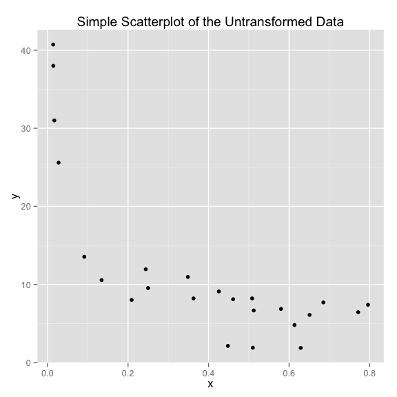
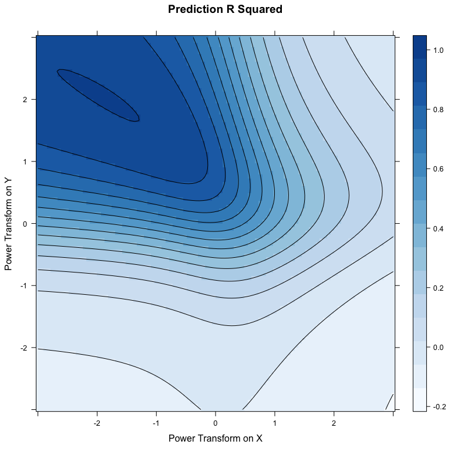
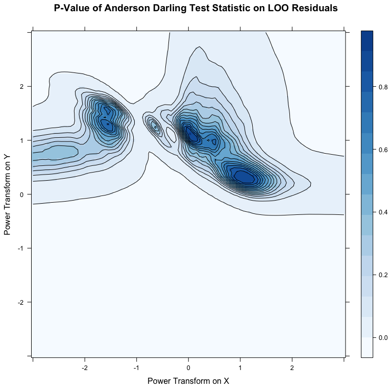
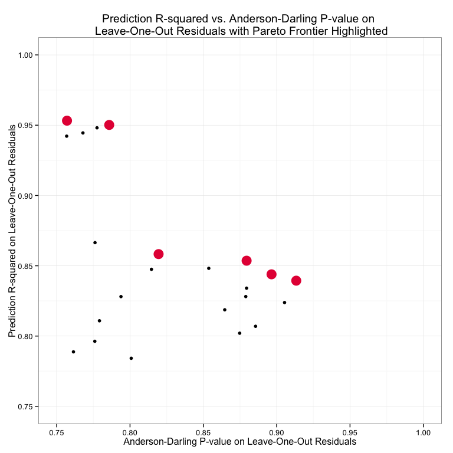
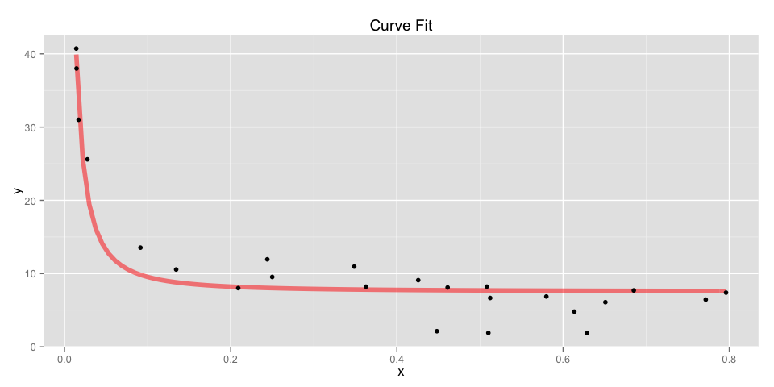
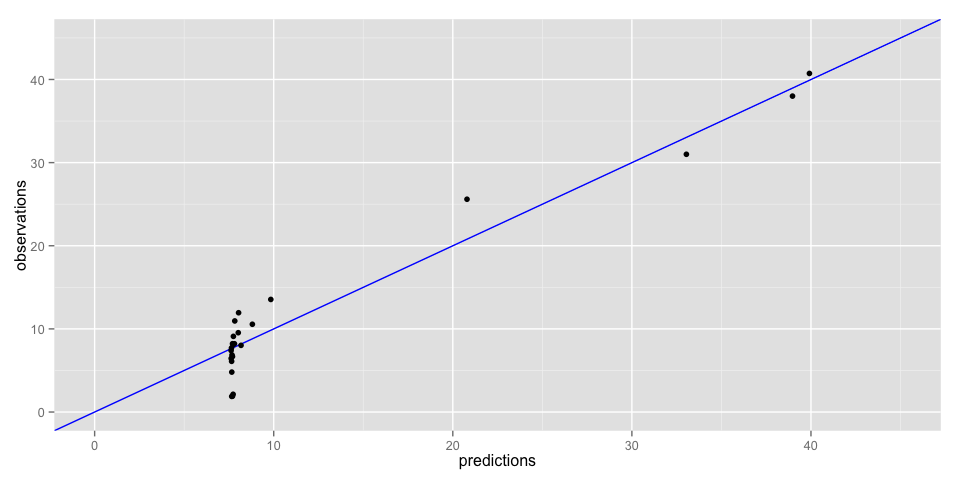

# Vignette: Regression Frontier
  
  

<script type="text/javascript" src="js/jquery.min.js"></script>
<script type="text/javascript" src="js/jquery-ui.min.js"></script>
<script type="text/javascript" src="js/jquery.fancybox-1.3.4.pack.min.js"></script>
<script type="text/javascript" src="js/jquery.tocify.js"></script>
<script type="text/javascript" src="js/jquery.scianimator.min.js"></script>
<script type="text/javascript" src="js/page.js"></script>
<script>  </script>
<link type="text/css" rel="stylesheet" href="css/jquery.tocify.css" />
<link type="text/css" rel="stylesheet" media="screen" href="css/jquery.fancybox-1.3.4.css" />
<link type="text/css" rel="stylesheet" href="css/style.css"
<head> <div id="tableofcontents"></div> </head>
<div id="source" class="tocify"> 
<ul class="tocify-header nav nav-list">
<li class="tocify-item active" style="cursor: pointer;">
<a onclick='toggle_R();' >Show / Hide Source</a>
</li></ul>
</div>
__Kevin M. Smith // Environmental Statistics // Fall 2014__
<hr>


<hr>
# Overview
The purpose of this short note is to explore the [Pareto frontier](http://en.wikipedia.org/wiki/Pareto_efficiency#Pareto_frontier) when there are multiple objectives. In this case the trade-offs are between $R_{pred}^2$ and the apparent normality of the leave-one-out residuals via the p-value of the [Anderson Darling test statistic](http://en.wikipedia.org/wiki/Anderson–Darling_test). 
<hr>
## The Mystery Data
This note uses data of unknown origin, but that is clearly non-linear in it's untransformed state. In the following section a range of power transforms will be applied on $x$ and $y$ before fitting linear regressions of the form $(y_{transformed} = \beta x_{transformed} + \epsilon)$. 
<br><br>
 


```r
# Load in Data
mystery <- read.csv("data/mystery.csv", header=FALSE)

colnames(mystery) <- c("y", "x")

yyy <- unlist(mystery[1])
xxx <- unlist(mystery[2])

qplot(x = xxx, y = yyy) + xlab("x") + ylab("y") +
  ggtitle("Simple Scatterplot of the Untransformed Data")
```

 

> __See this [vignette on Tukey's bulging rule](http://kevin-m-smith.github.io/CEE202/Regression/BulgingDiagram/) or use [this interactive transform tool](http://kevin-m-smith.github.io/CEE202/Regression/SimpleTransformTool/) to get a better sense of the transformations that will be performed.__

<br>
<hr>
# Contour Plots 
<br>


## $R_{pred}^2$
After running many regressions on variables subject to power transforms in the search space $t \in [-3, 3]$, a locally optimal region of the $R_{pred}^2$ can be identified between $t_x \in [-1.5, -2.7]$ and $t_y \in [1.7, 2.4]$, where $t_x$ and $t_y$ are the power transforms on $x$ and $y$ respectively.  


```r
levelplot(pred.r2~px+py, data = results, contour = TRUE, panel=function(...) {
  arg <- list(...)
  panel.levelplot(...)},
  col.regions=colorRampPalette(brewer.pal(9,"Blues")[1:8]),
  xlab = "Power Transform on X",
  ylab = list("Power Transform on Y", rot=90),
  main = "Prediction R Squared")
```

 

## Normality of LOO Residuals

Here the p-value of the Anderson-Darling test statistic is used as a surrogate measure for the apparent normality of the leave-one-out (loo) residuals. At first blush this may seem like a blatant abuse of the test statistic and a malignant use of a p-value. While I would concede the point if pushed on it, I think the apparent continuity in the search space $t \in [-3, 3]$ suggests that the p-value can innocently (i.e. soundly) assist in the identification of regions where the loo residuals _appear_ normal. In either case, the resulting contour plot is shown below. 


```r
levelplot(pred.ad~px+py, data = results, contour = TRUE, panel=function(...) {
  arg <- list(...)
  panel.levelplot(...)},
  col.regions=colorRampPalette(brewer.pal(9,"Blues")[1:8]),
  xlab = "Power Transform on X",
  ylab = list("Power Transform on Y", rot=90),
  main = "P-Value of Anderson Darling Test Statistic on LOO Residuals")
```

 


# Pareto Selection

The points on the Pareto frontier of $R_{pred}^2$ vs. the Anderson Darling p-value is shown for the upper-right-hand corner of the solution space. 


```r
g <- ggplot(results, aes(x = pred.ad, y = pred.r2)) + geom_point() + theme_bw()
g <- g + xlim(0.75, 1) + ylim(0.75, 1)

top.sorted <- arrange(results, pred.ad, pred.r2, decreasing = TRUE)
pareto.points = top.sorted[which(!duplicated(cummax(top.sorted$pred.r2))), ] 
g <- g + annotate("point", x=pareto.points$pred.ad, 
                  y=pareto.points$pred.r2, colour = "#e51843", size = 6)
g <- g + ggtitle("Prediction R-squared vs. Anderson-Darling P-value on \n Leave-One-Out Residuals with Pareto Frontier Highlighted")
g <- g + xlab("Anderson-Darling P-value on Leave-One-Out Residuals")
g <- g + ylab("Prediction R-squared on Leave-One-Out Residuals")
g
```

```
## Warning: Removed 9977 rows containing missing values (geom_point).
```

```
## Warning: Removed 17 rows containing missing values (geom_point).
```

 

# Curve Fitting
The optimal transform is chosen according to the preferences assigned to the particular objectives. Choosing, for the sake of example, an arbitrary point from the Pareto frontier, yields the following curve in real-space.


```r
best <- subset(pareto.points, pred.ad > 0.75 & pred.ad < 0.78)

best.transform <- data.frame( y = yyy^best$py, x = xxx^best$px)
best.lm <- lm(y~x, data = best.transform)

b0 <- coef(best.lm)[1]
b1 <- coef(best.lm)[2]

fit.curve <- function(x){
  (b1*(x^best$px) + b0)^(1/best$py)
}

g <- ggplot() + ggtitle("Curve Fit")
g <- g + xlab("x")
g <- g + ylab("y")
g <- g + stat_function(aes(x = xxx), fun = fit.curve, 
                       colour = "red", lwd = 2, alpha = 0.5)
g <- g + geom_point(aes(x = xxx, y = yyy))
g
```

 

The selected power transformations on $x$ and $y$ are: 

```r
power.transforms <- data.frame(power.of.y = best$py,
                               power.of.x = best$px)

pander(power.transforms, caption = "")
```


-------------------------
 power.of.y   power.of.x 
------------ ------------
   1.364        -1.606   
-------------------------
<br><hr>
Finally, the model parameters and performance in the transformed space:

```r
pander(summary(best.lm), caption = "")
```


--------------------------------------------------------------
     &nbsp;        Estimate   Std. Error   t value   Pr(>|t|) 
----------------- ---------- ------------ --------- ----------
      **x**         0.147      0.006372     23.06   6.639e-17 

 **(Intercept)**    15.74       1.955       8.048   5.348e-08 
--------------------------------------------------------------


-------------------------------------------------------------
 Observations   Residual Std. Error   $R^2$   Adjusted $R^2$ 
-------------- --------------------- ------- ----------------
      24               8.755         0.9603       0.9585     
-------------------------------------------------------------


```r
final.set <- data.frame(observations = yyy,
                        predictions = fit.curve(xxx))

g <- ggplot(final.set, 
            aes(x = predictions, y = observations)) 
g <- g + xlim(0, 45) + ylim(0, 45) + geom_abline(color = "blue")
g + geom_jitter()
```

 

<hr>

# Appendix

## Reproducibility Information

```r
pander(sessionInfo())
```

**R version 3.1.2 (2014-10-31)**

**Platform:** x86_64-apple-darwin13.4.0 (64-bit) 

**locale:**


**attached base packages:** 
[1] "_parallel_, _stats_, _graphics_, _grDevices_, _utils_, _datasets_, _methods_ and _base_" attr(,"class") [1] "knit_asis" attr(,"knit_cacheable") [1] TRUE

**other attached packages:** 
[1] "_pander(v.0.5.1)_, _doMC(v.1.3.3)_, _iterators(v.1.0.7)_, _foreach(v.1.4.2)_, _RColorBrewer(v.1.1-2)_, _lattice(v.0.20-29)_, _plyr(v.1.8.1)_, _nortest(v.1.0-2)_ and _ggplot2(v.1.0.0)_" attr(,"class") [1] "knit_asis" attr(,"knit_cacheable") [1] TRUE

**loaded via a namespace (and not attached):** 
[1] "_codetools(v.0.2-9)_, _colorspace(v.1.2-4)_, _digest(v.0.6.4)_, _evaluate(v.0.5.5)_, _formatR(v.1.0)_, _grid(v.3.1.2)_, _gtable(v.0.1.2)_, _htmltools(v.0.2.6)_, _knitr(v.1.8)_, _labeling(v.0.3)_, _MASS(v.7.3-35)_, _munsell(v.0.4.2)_, _proto(v.0.3-10)_, _Rcpp(v.0.11.3)_, _reshape2(v.1.4)_, _rmarkdown(v.0.3.10)_, _scales(v.0.2.4)_, _stringr(v.0.6.2)_, _tools(v.3.1.2)_ and _yaml(v.2.1.13)_" attr(,"class") [1] "knit_asis" attr(,"knit_cacheable") [1] TRUE
